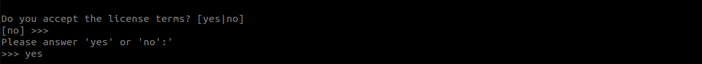

# Tutorial W03 - Settings things up

## Getting started
### Login to the cluster
  ```sh 
  $ ssh –Y USERNAME@euler.ethz.ch
  ```
### Setup git
- Generate ssh key
  ```sh 
  $ ssh-keygen -t ed25519  
  ```
- Print your public key  
  ```sh
  $ cat ./ssh/id_ed25519.pub
  ```
- Copy the public key to Github as done in tutorial 0.

- Login
  ```sh
  $ ssh -T git@github.com
  ```
- Clone repo:
  ```sh
  $ git clone git@github.com:Digital-Humans-23/tutorial-w03-YOURACCOUNT.git
  ```

### Installing conda (Linux / Cluster instructions):
- Navigate to home folder
  ```sh 
  $ cd
  ```
- Download and run installer.
  ```sh 
  $ wget https://repo.anaconda.com/miniconda/Miniconda3-py39_23.1.0-1-Linux-x86_64.sh
  $ chmod +x ./Miniconda3-py39_23.1.0-1-Linux-x86_64.sh
  $ ./Miniconda3-py39_23.1.0-1-Linux-x86_64.sh
  ```
- Accept License terms.
  
- Press enter to accept default installation.
  
- Allow installer to initialize Miniconda
  

- Disable activation of conda by default (Optional but recommended)
  ```sh 
  $ source .bashrc
  $ conda config --set auto_activate_base false
  ```

- We start with [conda](https://docs.conda.io/en/latest/) to set up an environment with the minimum
dependencies.
  ```sh 
  $ conda create --name simpleEnv python=3.9.2
  $ conda activate simpleEnv 
  ```

- Navigate to path of repo folder e.g.
  ```sh 
  $ cd <PATH TO repo folder>
  ```

- Install requirements
  ```sh 
  $ pip install -r requirements.txt 
  ```

### Compile on server
- Build `pycrl.so` (python wrapper of pyloco C++ libraries)
  ```sh
  $ mkdir build && cd build   
  $ env2lmod
  $ module load gcc/8.2.0 python/3.9.9 cmake/3.25.0 freeglut/3.0.0 libxrandr/1.5.0  libxinerama/1.1.3 libxi/1.7.6  libxcursor/1.1.14 mesa/17.2.3 eth_proxy
  # IMPORTANT: If you use a conda environment, you should add 
  # -DPython_EXECUTABLE=<PYTHON INTERPRETER PATH>  (Use absolute paths) e.g.:
  # cmake -DPython_EXECUTABLE=/cluster/home/mimora/miniconda3/envs/simpleEnv/bin/python3 -DCMAKE_BUILD_TYPE=Release ../
  $ cmake -DPython_EXECUTABLE=/cluster/home/<YOUR_USERNAME>/miniconda3/envs/simpleEnv/bin/python3 -DCMAKE_BUILD_TYPE=Release ../
  $ make 
  # Return to repo folder
  $ cd ..
  ```

### Run jobs on server
- Run job
  ```sh
  $ sbatch ./jobs/01_simple_job   
  ```
- Monitor job
  ```sh
  $ watch -n 1 squeue
  # Press Ctrl+C to stop monitoring the job 
  ```
- Check that job was run successfully (It should print `Done` ) 
  ```sh
  $ cat ./jobs/simple_job.out    
  ```
